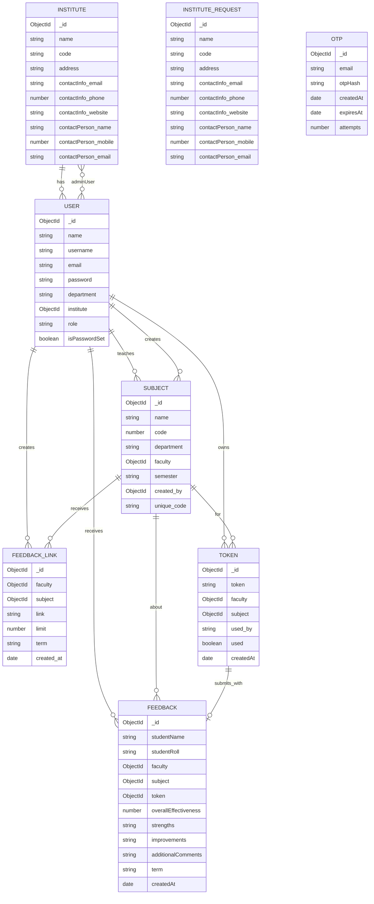

# Entity Relationship Diagram

This ERD is derived from the Mongoose schemas in `models/` and cross-checked against the controller logic that creates and queries those documents.

## Core ERD

## Relationship Notes

- `Institute -> User`: each user may belong to one institute through `User.institute`; an institute can have many users.
- `Institute.adminUser -> User[]`: the institute schema also keeps an array of admin users, which creates a second institute-to-user relationship for administrative ownership.
- `Subject.faculty -> User`: a subject may be assigned to one faculty user; one faculty can teach many subjects.
- `Subject.created_by -> User`: a subject can also track the user who created it.
- `FeedbackLink`: created for a faculty-subject-term combination and used to cap how many responses are allowed through `limit`.
- `Token`: generated for one faculty and one subject; expires automatically after 7 days.
- `Feedback`: each feedback record belongs to one faculty, one subject, and one token. In practice the app creates one feedback per token use, even though the schema does not enforce a unique database constraint on `token`.
- `Otp`: standalone support entity for login verification; it is linked by `email` rather than an ObjectId reference.
- `InstituteRequest`: mirrors institute onboarding data, but is separate from the live `Institute` collection.

## Important Implementation Note

There is one schema inconsistency in the current codebase:

- [`models/feedbackLink.js`](/mnt/c/Users/prath/OneDrive/Desktop/Feedback/Feedback-B/models/feedbackLink.js) defines `faculty` with `ref: "Faculty"`.
- The active controllers create and query feedback links with [`User`](/mnt/c/Users/prath/OneDrive/Desktop/Feedback/Feedback-B/models/user.js) ids, alongside `Subject`, `Token`, and `Feedback`, which all reference `User`.

Because the runtime flow consistently treats faculty members as `User` documents with `role: "faculty"`, the ERD above models that relationship as `User <-> FeedbackLink`. If you want, we can clean up that schema next so the database refs and the rest of the app fully agree.
